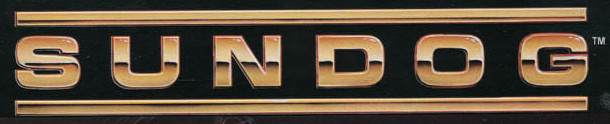
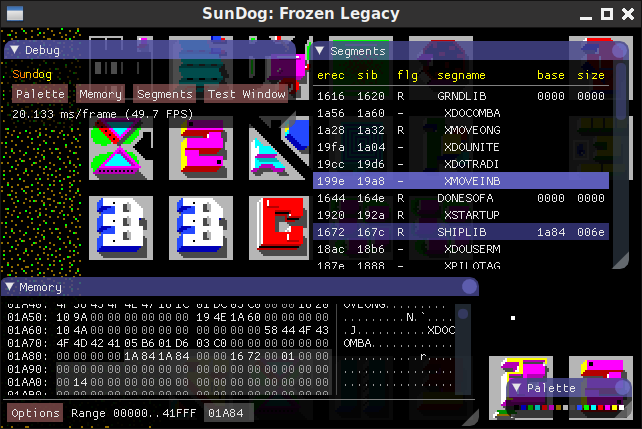

Sundog: Frozen Legacy
========================



This is a port of the Atari ST game SunDog: Frozen Legacy (1985) by
FTL software to modern platforms, using SDL2 for input and OpenGL ES 2+ for
graphics. A good overview of the gameplay can be found on [wikipedia](https://en.wikipedia.org/wiki/SunDog:_Frozen_Legacy).

The game was originally written in Pascal, developed using the well-known UCSD
Pascal compiler. This compiler compiles to bytecode called "p-code" for an
abstract architecture called the p-system. This project implements a p-system
interpreter (also called "P-Machine Emulator" or PME) in C, which is able to
run the game.

This makes it possible to run the game without emulating the Atari ST or even
68000 processor. There are a few assembly-language functions for (primarily)
graphics rendering, which have been re-implemented separately.

The goal of this port is to keep the gameplay and graphics close to the Atari
ST version, although small hacks or improvements would be welcome. See the
[Sundog Resurrection](http://sundogresurrectionproject.com) project for a complete re-imagining of the game.

Screenshots
-------------

 
 
 
 


Disk image
-------------

For copyright reasons this game does not come with the resources nor game code.
It requires the user to provide a 360K `.st` raw disk image of the game to run.
This can be imaged from an original copy or found on a dozen abandonware sites.
Be sure to use an image of the original disk: the re-packed version will not
work as the layout of the disk will be different.

Unlike the original game which writes to disk on every start, this
implementation never writes to the disk image.

Building from source
----------------------

### Linux

To build from source make sure the SDL2 development package for your
distribution is installed, as well as GNU readline (only necessary for the
debugger). On Debian and Ubuntu this is:

```bash
apt-get install libreadline-dev libsdl2-dev meson ninja-build
```

Then:

```bash
meson setup --buildtype release build
ninja -C build
```

### Build settings

The following settings can be set with `-Doption=value` on the meson command line, or through `meson configure`:
```
  Project options                                Default Value                                    Possible Values                                  Description
  -----------------                              -------------                                    ---------------                                  -----------
  builtin_image                                  false                                            [true, false]                                    Use built-in disk image (must be in game/sundog.st)
  debug_ui                                       false                                            [true, false]                                    Enable debug user interface
  game_cheats                                    false                                            [true, false]                                    Enable cheats
  psys_debugger                                  false                                            [true, false]                                    Enable P-system command line debugger
```

### Other platforms

People have built this software for other platforms. It should be pretty
straightforward, as we've tried hard to make the source and build system as
compatible as possible. Also, SDL2 and support for OpenGL ES 2.0+ (especially
when coupled with [ANGLE](https://github.com/google/angle)) is widely
available.

The CI checks run on Linux (gcc), MacOS (clang) and Windows (MSVC). However, no
instructions have been contributed for manual builds on these platforms.

Invocation
------------

The game can be started using the command line:

```
build/src/sundog[.exe] <image.st>
```

Where `<image.st>` is the Sundog disk image to use.

Other options can be provided:

- `--fullscreen`: Make window initially fullscreen.
- `--renderer <renderer>`: Set renderer to use:
  - `basic` is the default, which applies straightforward nearest pixel filtering
    to scale the image.
  - `hq4x` is a higher quality pixel art scaler that takes neighbour pixels
    into account. This is a more expensive algorithm that requires a GPU
    capable of OpenGL ES 3.0.
- `--help`: Display a help message and exit.

Playing
---------

After starting the program the game will immediately start. 

Lots of hints for playing the game, as well as the original manual can be found
on the excellent [Sundog information page](http://www.lukin.com/sundog/).

### Key shortcuts

The game is controlled with the mouse only. There are however some key
shortcuts for the interpreter:

- ` ` Pause/unpause game
- `s` Save state to `sundog.sav` in current directory.
- `l` Load state from `sundog.sav` in current directory.

Some other shortcuts are debugging related, see [debugging.md](doc/debugging.md).

Status
---------

### What works?

- Loading screen graphics, palette effects.
- Starting a new game.
- Right-click popup in-game.
- Walking around the ship and in buildings.
- Liftoff / Landing.
- Sublight flight.
- Warp (with fancy effects).
- Loading / reading save states (`l` and `s` respectively).
- Ground combat.
- Space combat.
- Sound effects.
- Touch screen support: a small area in the top-right of the screen has been
  designated as "cancel area" and will emulate a right-mouse click when touched.

Is it fully playable? Yes, I played it for quite a bit. All the critical things
have been implemented, Though I cannot guarantee that there aren't any bugs
left. If so, please report them through the issue tracker, along with a saved
state if possible.

### To be done

Non-critical:

- The copy protection (integrity check) is mitigated in an ugly and brittle
  way. It would be better to emulate the underlying mechanism (which is known)
  in the simulated disk controller.

P-system
-----------

Sundog uses version `IV.2.1 R3.4` of the p-system. This is a version of the
p-system developed commercially by Softech. I looked at using [ucsd-psystem-vm](http://ucsd-psystem-vm.sourceforge.net/),
however this implements version `II.0` which is significantly different. As
far as I know this is the only open source, publicly available p-system
IV implementation. It is fairly independent of the game, so if it is useful
for anything else it could be factored out to a library. Code for the p-system
interpreter is in [src/psys](src/psys).

The p-system has a custom disk layout (this is why on the Atari ST the disk
looks like it has only a small `.prg` and the rest of the disk is empty). This
layout is very basic: it supports only contiguous files, and there is only
the top-level directory.

P-code is stored in code files, which in turn are organized into segments.
Segments are self-contained and can be compared to "units" in later Pascal
variants. These in turn contain one or multiple procedures.

At bootstrap time the interpreter seeks into a code archive `SYSTEM.PASCAL`, loads
the segment `USERPROG`, and starts interpreting at procedure 1 of that segment.
From there the p-system takes care of the rest of initialization, eventually
executing `SYSTEM.STARTUP`. This is the game, in this case.

In modern terms the P-system is comparable to the Java Runtime Environment, but
more low-level. Some "advanced" features (for the time) that are supported:

- OS, architecture, endian-independent bytecode.

- Tasks (multi-tasking), synchronized using semaphores.

- External events (user input, timer interrupts) can signal semaphores.

- Paging ("swapping") of code. Segments are loaded when accessed, causing a
  segment fault to occur. When there is memory pressure, least recently used
  code segments are discarded, and will be reloaded when used again.

- Run-time error handling.

- Dynamic memory management (the heap).

It most notably does NOT do:

- Security and sandboxing. Everything can read and write everywhere.

- Address more than 64KiB (or 128KiB on word-addressed architectures) of data
  memory. It does however use "code pools" to be able to store more code and
  string constants.

The game includes a rudimentary debugger (use *d* key to start it) which can be
used to poke around in the internals of the p-machine.

The best overview of the internals of the p-system version IV is the
"p-System Software Reference Library: Internal Architecture", which can be
found [on bitsavers](http://bitsavers.informatik.uni-stuttgart.de/pdf/sage/sageandstride/Internal_Architecture-1.140.41.A.pdf).

## Retrospect

In retrospect we could have gotten away with emulating way less of the actual
p-system, if we'd emulated at the run-time level instead of the OS level. The
game doesn't use any of the OS functionality, besides one background task. The
paging was not required even with the 1MB of memory of an Atari ST. Most game
data is static, it hardly uses dynamic memory management.

So we could do away with SofTech's `SYSTEM.PASCAL` runtime and replace it with
a minimal stub in C. Run the game itself only.

That said, I didn't have enough knowledge about the whole thing when I started
this, and besides, it's kind of cool how this project is as much of a toy
operating system as a game. Unless the PASCAL source code of the original game
happens to become open source (:smile:) there's little reason to do otherwise.

Debug UI
---------



A debug UI can be compiled in to aid with debugging and reverse engineering. For more information, see [debugging.md](doc/debugging.md).

Credits
--------

Authors:

- Wladimir J. van der Laan

Contributions in the form of github pull requests are very welcome.

Special thanks to:

- [Bitsavers](http://bitsavers.trailing-edge.com)
- The former UCSD pascal group on Yahoo
- [ocornut](https://github.com/ocornut) for the "dear imgui" GUI system used for debug GUI
- Mitsutaka Okazaki for emu2149
- Of course late FTL software: Bruce Webster, Doug Bell, Wayne Holder, Mike Newton, Andy Jaros for making SunDog in the first place.

License
---------

This software is provided under the MIT license.
