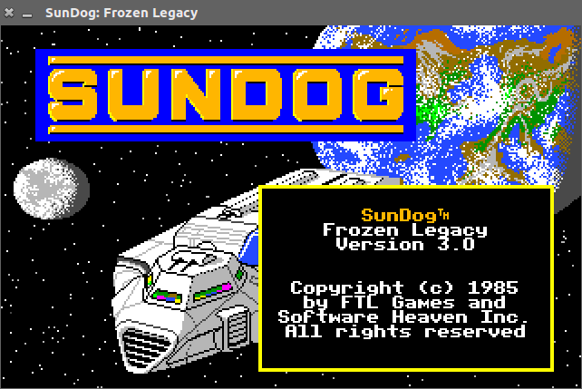
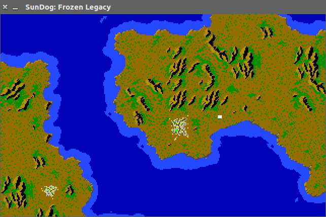
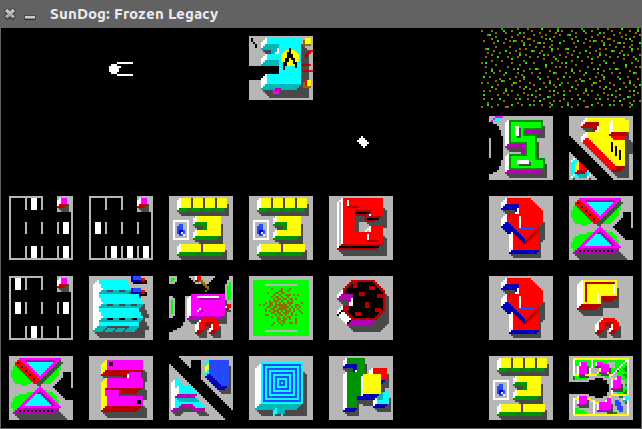
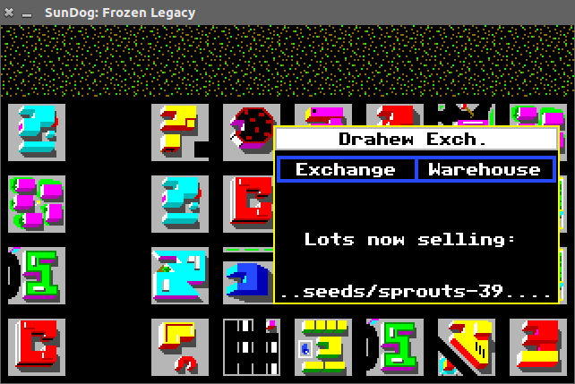
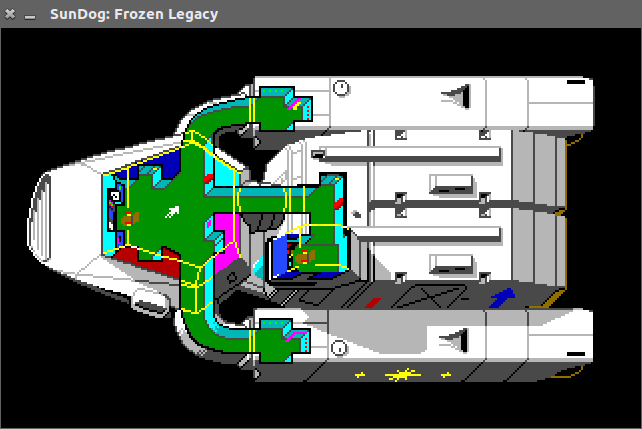
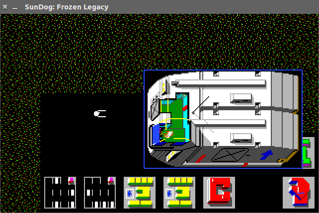
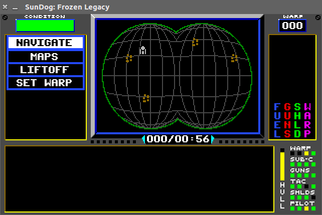
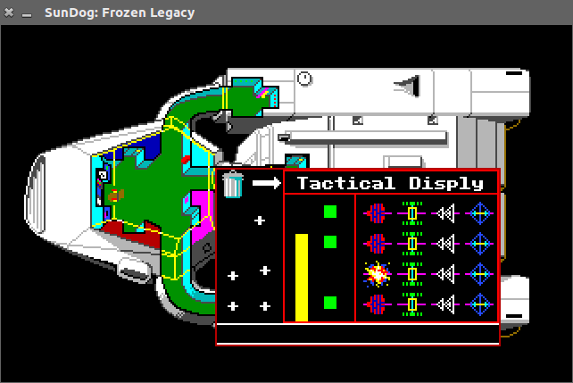
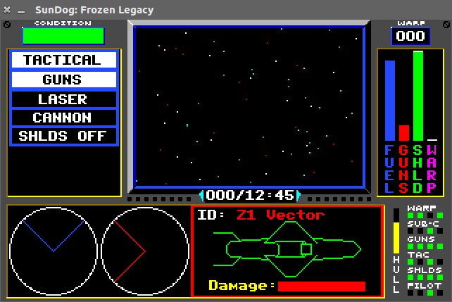

Sundog: Frozen Legacy
========================

This is a port in progress of the Atari ST game SunDog: Frozen Legacy (1984) by
FTL software to modern platforms, using SDL2 for input and OpenGL ES 2 for
graphics. A good overview of the gameplay can be found on [wikipedia](https://en.wikipedia.org/wiki/SunDog:_Frozen_Legacy).

The game was originally written in Pascal, developed using the well-known UCSD
Pascal compiler. This compiler compiles to bytecode called "p-code" for an
abstract architecture called the p-system. This project implements a p-system
interpreter (also called "P-Machine Emulator" or PME) in C, which is able to
run the game.

This makes it possible to run the game without emulating the Atari ST or even
68000 processor. There are a few assembly-language functions for (primarily)
graphics rendering, which have been re-implemented separately.

The goal of this port is to keep the gameplay and graphics close to the Atari
ST version, although small hacks or improvements would be welcome. See the
[Sundog Resurrection](http://sundogresurrectionproject.com) project for a complete re-imagining of the game.

Screenshots
-------------

 
 
 
 


Disk image
-------------

For copyright reasons this game does not come with the resources nor game code.
It requires the user to provide a 360K `.st` raw disk image of the game to run.
This can be imaged from an original copy or found on a dozen abandonware sites.
Be sure to use an image of the original disk: the re-packed version will not
work as the layout of the disk will be different.

Unlike the original game which writes to disk on every start, this
implementation never writes to the disk image.

Building from source
----------------------

To build from source make sure the SDL2 development package for your
distribution is installed, the OpenGL ES 2 headers, as well as GNU readline
(only necessary for the debugger). On Ubuntu this is:

```bash
apt-get install libreadline-dev libsdl2-dev libgles2-mesa-dev
```

Then:

```bash
cd src
make
```

Invocation
------------

To run, you'll need a graphics driver as well as hardware capable of supporting
OpenGL ES 2.0. This is pretty much the lowest common denominator for graphics
rendering these days.

The game can be started using the command line:

```
./sundog <image.st>
```

Where `<image.st>` is the Sundog disk image to use.

Playing
---------

After starting the program the game will immediately start. 

Lots of hints for playing the game, as well as the original manual can be found
on the excellent [Sundog information page](http://www.lukin.com/sundog/).

### Key shortcuts

The game is controlled with the mouse only. There are however some key
shortcuts for the interpreter:

- `s` Save state to `sundog.sav` in current directory.
- `l` Load state from `sundog.sav` in current directory.

Some other shortcuts are debugging related, see [debugging.md](doc/debugging.md).

Status
---------

### What works?

- Loading screen graphics, palette effects.
- Starting a new game.
- Right-click popup in-game.
- Walking around the ship and in buildings.
- Liftoff / Landing.
- Sublight flight.
- Warp (albeit without fancy effects).
- Loading / reading save states (`l` and `s` respectively).
- Ground combat.
- Space combat.

Is it fully playable? Probably: all the critical things have been implemented,
but not everything has been tested so there may be remaining bugs.

### To be done

Non-critical:

- *Sound*: as the game uses XBIOS DoSound call for sound, this would involve
  emulating the YM2149F PSG sound chip, at least up to a point (or as there
  seems to be a fixed number of 36 sound effects: substituting
  sampled sounds).
- *Initial FTL animation is missing*: this is an assembly routine that triggers
  *before* the bootstrapping of the p-machine.
- *Not all of the stuff in SHIPLIB has been implemented.* There are four native
  procedures in this segment (0x16, 0x18, 0x19, 0x1a) which seem to be
  rendering effects for the ship the viewscreen (stars, explosion, fire
  weapon animation, warp animation respectively). There seems to be no further
  user interaction code. Only the warp animation is completely not implemented at this
  time, the others are at least able-enough placeholders.

### Future ideas

The input for this game is mouse-only, it takes mouse position and two-buttons
state. The screen resolution is only 320×200 (doubled to 640×400). This makes
it ideally suited for touch screen. An Android port of this would be would be
fantastic.

P-system
-----------

Sundog uses version `IV.2.1 R3.4` of the p-system. This is a version of the
p-system developed commercially by Softech. I looked at using [ucsd-psystem-vm](http://ucsd-psystem-vm.sourceforge.net/),
however this implements version `II.0` which is significantly different. As
far as I know this is the only open source, publicly available p-system
IV implementation. It is fairly independent of the game, so if it is useful
for anything else it could be factored out to a library. Code for the p-system
interpreter is in [src/psys](src/psys).

The p-system has a custom disk layout (this is why on the Atari ST the disk
looks like it has only a small `.prg` and the rest of the disk is empty). This
layout is very basic: it supports only contiguous files, and there is only
the top-level directory.

P-code is stored in code files, which in turn are organized into segments.
Segments are self-contained and can be compared to "units" in later Pascal
variants. These in turn contain one or multiple procedures.

At bootstrap time the interpreter seeks into a code archive `SYSTEM.PASCAL`, loads
the segment `USERPROG`, and starts interpreting at procedure 1 of that segment.
From there the p-system takes care of the rest of initialization, eventually
executing `SYSTEM.STARTUP`. This is the game, in this case.

In modern terms the P-system is comparable to the Java Runtime Environment, but
more low-level. Some "advanced" features (for the time) that are supported:

- OS, architecture, endian-independent bytecode.

- Tasks (multi-tasking), synchronized using semaphores.

- External events (user input, timer interrupts) can signal semaphores.

- Paging ("swapping") of code. Segments are loaded when accessed, causing a
  segment fault to occur. When there is memory pressure, least recently used
  code segments are discarded, and will be reloaded when used again.

- Run-time error handling.

- Dynamic memory management (the heap).

It most notably does NOT do:

- Security and sandboxing. Everything can read and write everywhere.

- Address more than 64KiB (or 128KiB on word-addressed architectures) of data
  memory. It does however use "code pools" to be able to store more code.

The game includes a rudimentary debugger (use *d* key to start it) which can be
used to poke around in the internals of the p-machine.

The best overview of the internals of the p-system version IV is the
"p-System Software Reference Library: Internal Architecture", which can be
found [on bitsavers](http://bitsavers.informatik.uni-stuttgart.de/pdf/sage/sageandstride/Internal_Architecture-1.140.41.A.pdf).

Author
---------

- Wladimir J. van der Laan

Special thanks to:

- [Bitsavers](bitsavers.trailing-edge.com)
- The UCSD pascal group on Yahoo

License
---------

This software is provided under the MIT license.
